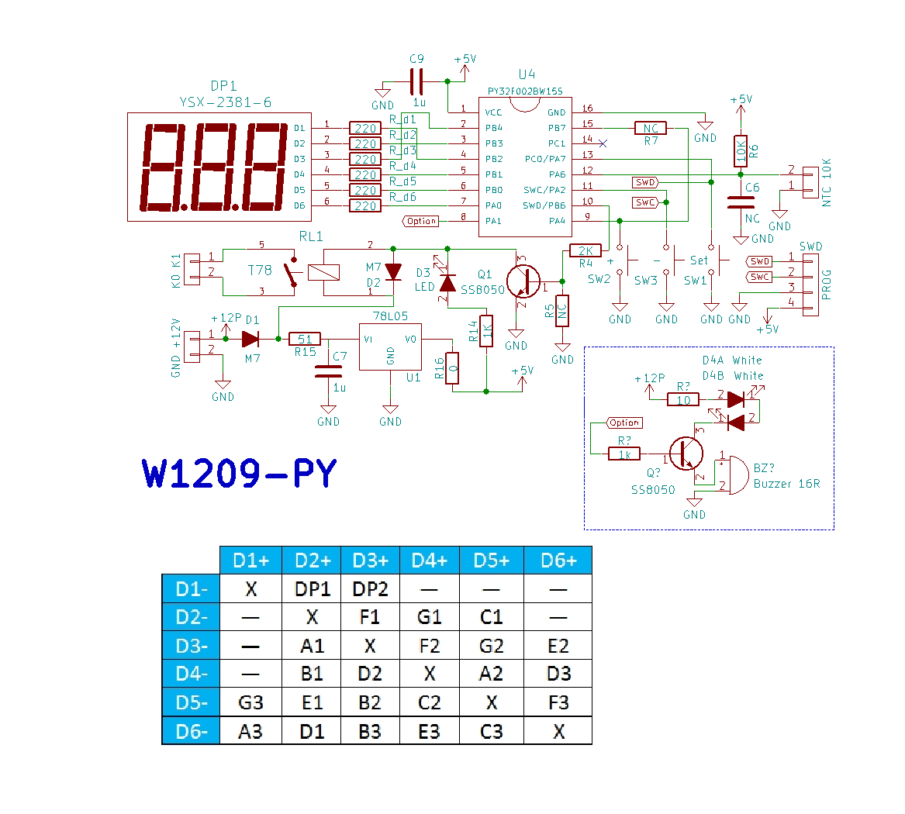

For the english version, click [here](README.EN.MD).

**Descripción:**

El siguiente proyecto es la modificación del termostato W1209 para
realizar unas mejoras que permiten funciones avanzadas. Algunas de ellas
son:

- 31 Menús autoexplicativos configurables en inglés o en español. (el
  original tiene 6 u 8 y necesitan de un tutorial)

- Un temporizador con periodo de ajuste hasta 999 días.

- Avisador visual/acústico (alarma) (es opcional, pero recomentable)

- Dos alarmas independientes tanto para calor como frío.

- Posibilidad de reajustar la resistencia de Pullup del sensor (hay que
  cambiar físicamente R6 si es necesario)

- Control preciso de temperatura

- Resolución de dos dígitos

- Conversión de escalas Celsius y Farhenheit (la eterna promesa\...)

- Rangos de temperatura extendidos (desde -273,15 ºC hasta 100000000
  ºC). Ahora no hay que hacer nada especial para que el termostato
  funcione bien en una Pulltruder. Aplicaciones de alta temperatura como
  en impresión 3D.

- Hasta 5 memorias para hacerlo funcionar en distintos escenarios.

- Ajuste de las condiciones de trabajo (velocidad de respuesta,
  precisión, resistencia del cable sensor en caso de que este se sitúe a
  larga distancia)

- Incluso un ajuste preciso del ADC en caso de que se produzca una
  contribución ajena de voltaje en el circuito de sensado (Por ejemplo,
  un potencial electroquímico debido a la unión de diferentes metales).

- Permite apagar y encender el relé haciendo un bypass del termostato

- Posibilidad de configurar como sensor cualquier resistencia NTC, PTCs,
  o incluso cualquier componente con respuesta NTC o PTC, como un diodo
  o un mosfet.

La modificación parte de la variante HW-557C o la que tenga un layout de
PCB similar. La modificación es posible en otros layouts pero es
necesario adatar el código al pinout del microcontrolador utilizado. La
versión HW-557C utiliza el microcontrolador de 8 bits y 8 céntimos de
dólar/euro, FMD FT61E143. La adaptación utiliza el microcontrolador ARM
M0+ de 32 bits, 24kB de flash y 3kB de RAM modelo PY32F002BW15, de 8
céntimos igualmente. Las versiones de Nuvoton M51blahblah y de STM8S003,
pueden ser actualizadas a PY32F002BF15 (notar la F) ya que este MCU
dispone del mismo pinout. No obstante no tengo ningún termostato con
esos MCUs ahora mismo, y habría que adaptar las lineas GPIO a la
configuración de estos micros.

Para compilar y/o flashear el código en el MCU, se puede hacer
utilizando el tutorial del gran desarrollador IOSETTING que podeis
encontrar en el PY32F0 template de su github:

<https://github.com/IOsetting/py32f0-template>

También se puede echar un vistado a su interesantísimo blog:

<https://www.cnblogs.com/milton/p/18168592>

NOTA: La primera vez que se flashea el código del termostato en nuestro
MCU (PY32F002B), se usan las líneas SWD PA2 (SWC), y PB6 (SWIO). Pero en
la primera ejecución del código, SWIO pasa a ser PA7 (es una
configuración que admite el MCU), y esto hace que en la placa de W1209,
PA7 sea la línea del MCU que se lleva a la cabecera de pines PROG.
Además, para poder acceder a la programación de nuevo, es necesario que
nada más encender el MCU, PA4 esté a 0, es decir, GND (esto se consigue
en el módulo W1209 simplemente apretando el botón "+" mientras se
conecta la alimentación). De esa forma el firmware entra en modo
programación y deja habilitadas PA2 y PA7 como SWC y SWIO
respectivamente. Una vez en este modo, no es necesario mantener PA4 a
cero por lo que simplemente se puede soltar el botón una vez el display
indica el modo de programación.

Antes de dar la chapa con el manual de uso de esta mejora, recomiendo
visionar este video de youtube a partir de 40:15

<https://www.youtube.com/watch?v=GLePONN3KA0&t=40m15s>

Además en el video, desde el principio, se detalla todo el proceso de
modificación, desde la grabación del firmware hasta el encendido y
funcionamiento del dispositivo.

<https://www.youtube.com/watch?v=GLePONN3KA0>

El funcionamiento del firmware del W1209-PY se basa en la ecuación
simplificada de Steinhart-hart, concretamente en la forma:

$$T_{1} = \frac{\beta}{\ln{\frac{R_{1}}{R_{0}} + \frac{\beta}{T_{0}}}} = \ \frac{\beta}{\ln{R_{1} - \ln R_{0}} + \frac{\beta}{T_{0}}}$$

En el siguiente esquema se muestra la
variación de la versión HW-557C adaptada a la mejora del W1209-PY.

La operación de W1209-PY es parecida a la del módulo original. Se ha
intentado conservar cierta "compatibilidad" para que la gente que ya
usara el módulo antiguo, no se sienta incómoda aprendiendo de nuevo a
usarlo.

Sin embargo hay varios métodos de edición numérica. Está la edición
simple, para algunos parámetros que no necesitan más que mantener
pulsado el botón "+" o el botón "-" para llegar al valor deseado.
Mantener la pulsación en cada uno de estos botones por separado, hace
que los números vayan incrementado o decrementando cada vez más rápido.
Si mientras se mantiene uno de ellos pulsado, se pulsa el otro con una
pulsación larga, entonces el valor se resetea a 0.

También hay algunos menús "P" que implementan la edición dígito a
dígito. En parámetros grandes, cuando no es práctico modificar un número
subiendo o bajando con los botones "+" y "-", se usa la edición dígito a
dígito. Se entra en dicha edición con una pulsación corta de "+" o "-"
si el menú es el adecuado para esta edición. Entonces en la pantalla
aparecerá una leyenda del tipo "1d0". El número de la izquierda es la
posición del dígito a editar, y el de la derecha el valor del número. Si
el valor del número puede ser negativo, tras el dígito 9 aparecerá el
signo "-" que indica que al número se le puede dar valor negativo. Una
pulsación corta en SET conmuta entre seleccionar el dígito y su valor
para editarlo/cambiarlo. Los dígitos que tengan una coma decimal verán
esa coma en el parámetro "d" (generalmente en la posición 2 del número
completo). Una pulsación larga en SET memoriza el cambio y se vuelve al
menú "P" pero si se deja que acabe el tiempo de edición, la edición se
cancela y el valor no se modifica.

Todos los menús "P" tienen un tiempo tras el cual el termostato vuelve a
la pantalla principal de temperaturas, excepto los menús P18 y P19. En
estos modos el termostato espera indefinidamente a que el usuario
realice la captura del valor de la resistencia del sensor en ese
instante, o bien se cancele dicha captura cambiando a "no". La captura
se hace con una pulsación corta de "SET".

**Instrucciones generales:**

- En la pantalla de temperatura, una pulsación corta en "SET" entra en
  la configuración de temperatura objetivo. Se indica porque la pantalla
  queda intermitente indicando la temperatura deseada de activación.

- En la pantalla de temperatura, una pulsación larga (mayor a dos
  segundos) en "+" activa el relé independientemente de la
  configuración. Una pulsación larga en "-" lo desactiva. Una pulsación
  corta en cualquiera de estos dos botones, para la alarma por run
  timeout del temporizador (desactiva la función de temporización), o en
  caso de que el temporizador esté funcionando, una pulsación hace que
  se muestre el tiempo restante.

- En la pantalla de temperatura, una pulsación larga en "SET" da paso al
  menú P (Programa, Parámetro, Pernambuco, lo que sea). Otra pulsación
  larga, o bien esperar sin tocar nada durante unos 10 segundos, guarda
  la configuración que se haya modificado y vuelve a la pantalla de
  temperatura actual. Una pulsación corta en el menú "P" entra en cada
  opción de menú.

A continuación se detalla un listado de las funciones, programas,
parámetros, parafernalias...

<table>
<colgroup>
<col style="width: 19%" />
<col style="width: 22%" />
<col style="width: 58%" />
</colgroup>
<thead>
<tr class="header">
<th>
<strong>NUMERO de</strong>

<strong>programa</strong>
</th>
<th><strong>Nombre</strong></th>
<th><strong>Función</strong></th>
</tr>
</thead>
<tbody>
<tr class="odd">
<td>P0</td>
<td>Funcionalidad</td>
<td>
Permite seleccionar tres modos:

<ul>
<li>
Calentador
</li>
<li>
Enfriador
</li>
<li>
Ventana

<ul>
<li>
Activa dentro de ventana
</li>
<li>
Activa fuera de ventana
</li>
</ul></li>
</ul>

El modo “Ventana” es un modo que no tiene el original, y permite que
el dispositivo se active o no en un rango de temperaturas dentro de la
ventana configurada en P1.
</td>
</tr>
<tr class="even">
<td>P1</td>
<td>Margen</td>
<td>Configura la histéresis o la temperatura de retorno. Por ejemplo, si
la temperatura objetivo es 25.00ºC, y el margen es de 2.00ºC, si está en
modo calentador, el termostato se desactiva cuando se alcance la
temperatura de 25 ºC y se desactiva al alcanzar la temperatura de
25-2=23 ºC. Este valor puede ser negativo, en tal caso el margen es
superior, es decir, si la temperatura objetivo es 25ºC, la desactivación
se haría a 27ºC y la activación a 25º (en definitiva, se invierten los
roles). Si P0 está configurado en ventana, entonces P1 representa la
anchura de la ventana (el intervalo de temperatura en el que el relé
está activo o inactivo)</td>
</tr>
<tr class="odd">
<td>P2</td>
<td>Temp. Máxima</td>
<td>Límite máximo de temperatura que puedes asignar a la temperatura
objetivo o deseada. Este menú se incluye por compatibilidad pero
realmente es una opción totalmente inútil.</td>
</tr>
<tr class="even">
<td>P3</td>
<td>Temp. Mínima</td>
<td>Lo mismo pero con la temperatura mínima. Sea cual sea esta
temperatura, internamente el termostato fija la temperatura mínima en 0
kelvin, lo que significa que no se puede configurar por debajo de
-273.15ºC.</td>
</tr>
<tr class="odd">
<td>P4</td>
<td>Desviación</td>
<td>Número de grados a corregir en la medida del sensor. Como la medida
del sensor no es lineal sino logarítmica con respecto a la temperatura,
sumar una cantidad de temperatura para ajustar la precisión es algo
totalmente inútil ya que ajustas la precisión en una temperatura y la
desajustas en el resto, pero se incluye por compatibilidad.</td>
</tr>
<tr class="even">
<td>P5</td>
<td>Tiempo de espera</td>
<td>En esta opción, sólo se configura si se desea que los tiempos de
espera de activación o desactivación una vez haya un cambio de estado
sean, o en segundos o en minutos. Los tiempos separados para cada cambio
se configuran de manera independiente en los menús P21 y P22.</td>
</tr>
<tr class="odd">
<td>P6</td>
<td>Alarma 1</td>
<td>Si se activa la alarma 1, se puede configurar para que el
dispositivo apague el relé y de un aviso óptico-acústico, una vez se
supere dicha temperatura. Si la temperatura de la alarma es superior a
la temperatura objetivo (más el margen o ventana), la alarma indicará
“demasiado caliente”. Si la temperatura de la alarma se configura por
debajo de la temperatura objetivo (más el margen o ventana), indicará
“demasiado frío”. Si dos alarmas se activan, la pantalla indicará la
alarma cuya temperatura esté más alejada del objetivo.</td>
</tr>
<tr class="even">
<td>P7</td>
<td>Alarma 2</td>
<td>
Comportamiento idéntico a Alarma 1, pudiendo configurarse las dos
en “muy caliente”, “muy frío”, o una caliente y la otra en frío.

NOTA IMPORTANTE: Si cualquiera de las alarmas se establece “dentro”
del margen configurado de temperatura, la respuesta del dispositivo es
impredecible, y en ocasiones acaba dejando de visualizar la medición de
temperatura. Esto es porque no tiene sentido que una alarma esté dentro
del rango de funcionamiento del termostato. Si es el caso, todavía se
puede acceder al menú y desactivar la alarma o hacer un reset de
fábrica.
</td>
</tr>
<tr class="odd">
<td>P8</td>
<td>
Seleccionar

Escala
</td>
<td>En modelos antiguos se suponía que alguna función añadida convertía
de escala Farhenheit a Celsius y viceversa. Nunca funcionaba. En esta
ocasión sí que funciona, indicando cuando corresponde, temperaturas en
ºF o ºC. Todas las temperaturas internamente se gestionan en Kelvin
dentro del dispositivo, y sólo se hacen las conversiones a Celsius o
Farhenheit en el display ya sea para mostrar o para editar.</td>
</tr>
<tr class="even">
<td>P9</td>
<td>Valores por defecto</td>
<td>En este caso, si se selecciona, el “preset” actual, o memoria de
trabajo, descarta la configuración actual y recupera la configuración
por defecto almacenada en el código. También se da la posibilidad de
borrar las 5 zonas de memoria de los 5 presets, de manera que si antes
de salir del menú, se apaga el dispositivo, al iniciar es como si nunca
se hubiera encendido antes.</td>
</tr>
<tr class="odd">
<td></td>
<td></td>
<td></td>
</tr>
<tr class="even">
<td>P10</td>
<td>Temporizador</td>
<td>Esta función utiliza la precisión del reloj interno del MCU (sobre
1%) para implementar un RTC en el que ir descontando días, horas,
minutos, y segundos. Si la opción se activa y se configura un tiempo
mayor de 0 segundos, cada 10 segundos la pantalla mostrará un mensaje
rodante con la información del tiempo restante. Al finalizar el tiempo,
el relé se desactiva y se emite un aviso acústico. La alarma de fuera de
tiempo se desactiva simplemente con una pulsación corta de “+” o de “-“,
recuperándose en este caso el control normal del termostato.</td>
</tr>
<tr class="odd">
<td>P11</td>
<td>Cambiar Tª objetivo por rotación</td>
<td>
Es la forma de editar la temperatura objetivo o deseada para
poder alcanzar una precisión de dos decimales.

Este menú activa la edición dígito a dígito.
</td>
</tr>
<tr class="even">
<td>P12</td>
<td>Ajuste R_PullUp</td>
<td>
Cuando se utiliza un NTC, debido al comportamiento no lineal de
este elemento, la mayor precisión se obtiene con valores de resistencia
de NTC próximos a R_PullUP. Si se pretende, por ejemplo, usar un NTC 10K
en el rango de 85ºC, a esa temperatura la resistencia del sensor es de
alrededor de 1kΩ. Si se cambia la R_PullUp a 1kΩ (hay que sustituir la
resistencia físicamen, no basta con cambiar sólo el valor en la
configuración), la temperatura a 25ºC será menos precisa pero a 85ºC
será mucho más estable y precisa.

Este menú activa la edición dígito a dígito.
</td>
</tr>
<tr class="odd">
<td>P13</td>
<td>Ajuste de R0</td>
<td>
Este valor es específico de cada termistor, y por lo general
corresponde a una configuración T0 de 25ºC. Es el valor
R0 en la ecuación Steinhart–Hart simplificada.

Este menú activa la edición dígito a dígito.
</td>
</tr>
<tr class="even">
<td>P14</td>
<td>Ajuste de T0</td>
<td>
Este valor es específico de cada termistor, y por lo general
corresponde a una configuración R0 dada por el fabricante a
esta temperatura. Es el valor T0 en la ecuación
Steinhart–Hart simplificada.

Este menú activa la edición dígito a dígito.
</td>
</tr>
<tr class="odd">
<td>P15</td>
<td>Ajuste de Beta</td>
<td>
B o “beta” es el parámetro de la ecuación Steinhart–Hart que
normalmente es derivado a partir de dos pares de resistencia/temperatura
llamados (R0,T0) y (R1,T1).
Teniendo Beta y además uno de los pares, se puede derivar el otro ya que
son intercambiables. Este parámetro lo suele definir el fabricante, por
ejemplo en la NTC 10K B3950 se indica que Beta es 3950. En este menú se
da la opción de actualizar R1 tomando como referencia el
valor de T1.

Este menú activa la edición dígito a dígito.
</td>
</tr>
<tr class="even">
<td>P16</td>
<td>Ajuste de R1</td>
<td>
Este valor es específico de cada termistor, y por lo general lo
deriva el fabricante a partir de la pareja (R0,T0) y el valor de Beta,
cuando determina una temperatura T1 de 85ºC. Es el valor
R1 en la ecuación Steinhart–Hart simplificada. Configurando
R1 (O bien capturando ese valor a la temperatura
T1, se puede parametrizar Beta.

Este menú activa la edición dígito a dígito.
</td>
</tr>
<tr class="odd">
<td>P17</td>
<td>Ajuste de T1</td>
<td>
Este valor es específico de cada termistor, y por lo general
corresponde a una configuración R0 dada por el fabricante. Es
el valor T1 en la ecuación Steinhart–Hart simplificada. A
diferencia de T0 y R0, que son las que proporciona
el fabriante o se consideran por defecto, T1 y R1
son las “temperaturas de uso”, sin embargo sólo es una nomenclatura.
Ambos pares permiten usarse junto a Beta para calcular cualquier
temperatura.

Este menú activa la edición dígito a dígito.
</td>
</tr>
<tr class="even">
<td>P18</td>
<td>Captura de R0</td>
<td>
Esta función es útil cuando tenemos un sensor desconocido y
queremos calibrarlo. Se configura una temperatura en T0 (no
es necesario que se trate de 25ºC) y cuando con un termómetro auxiliar,
la temperatura del sensor desconocido se ha alcanzado, se captura la
resistencia del sensor para usarla como R0. Por ejemplo se
puede usar una temperatura de sensor de T0 = 0ºC si se
sumerge el sensor en agua helada.

Este menú no se cancela tras el paso de un cierto tiempo, para dar
margen de espera a que el sensor alcance la temperatura de
calibración.
</td>
</tr>
<tr class="odd">
<td>P19</td>
<td>Captura de R1</td>
<td>
Esta función es útil cuando tenemos un sensor desconocido y
queremos calibrarlo. Se configura una temperatura en T1 (no es necesario
que se trate de 85ºC) y cuando con un ayuda de un termómetro auxiliar,
esa temperatura en el sensor desconocido se ha alcanzado, se captura la
resistencia del sensor para usarla como R1. Por ejemplo se
puede usar una temperatura de sensor de 100 grados si se sumerge el
sensor en agua hirviendo.

Teniendo definidos los pares (R0,T0)y
(R1,T1) se puede derivar Beta simplemente
accediendo al menú P16 o al P17.

Este menú no se cancela tras el paso de un cierto tiempo, para dar
margen de espera a que el sensor alcance la temperatura de
calibración.
</td>
</tr>
<tr class="even">
<td>P20</td>
<td>
Resistencia del Cable

(en ohmios)
</td>
<td>Si el cable del sensor es muy largo, puede ocurrir que añada unos
cuantos ohmios de resistencia que verá el termostato como si fuera del
sensor, interfiriendo la medida. Si esa resistencia del cable se
descuenta de la medida del sensor, el sensor recupera su precisión. Este
parámetro sólo puede tener valores positivos.</td>
</tr>
<tr class="odd">
<td>P21</td>
<td>Retraso en encendido</td>
<td>Especifica los segundos (o minutos, según P5) que ha de esperar el
relé desde que se llega a la temperatura objetivo (o a su margen) hasta
que el relé pasa de estar apagado a estar encendido. Configurable hasta
999 segundos o minutos.</td>
</tr>
<tr class="even">
<td>P22</td>
<td>Retraso en apagado</td>
<td>Especifica los segundos (o minutos, según P5) que ha de esperar el
relé desde que se llega a la temperatura objetivo (o a su margen) hasta
que el relé pasa de estar encendido a estar apagado, configurable hasta
999 segundos o minutos.</td>
</tr>
<tr class="odd">
<td>P23</td>
<td>Profundidad del filtro</td>
<td>La temperatura se toma alrededor de 80 veces por segundo, pero
aunque el ADC del PY32F002B es de 12bits, la resolución efectiva o ENOB
es aproximadamente 8 bits. Esto es debido al ruido interno del MCU. La
profundidad del filtro indica aproximadamente el número de bits que
promediará el filtro para obtener una lectura estable. Cuantos más bits,
más estabilidad pero el termostato será más lento. Este valor permite
ajustar un compromiso entre velocidad de respuesta y precisión.</td>
</tr>
<tr class="even">
<td>P24</td>
<td>Profundidad bits ADC</td>
<td>La profundidad nativa del ADC es 12 bits, pero mediante
sobremuestreo se pueden obtener más bits de resolución. Esto ralentiza
la respuesta del termostato, por eso este valor es un compromiso entre
velocidad de respuesta y precisión. La suma de bits del filtro y del ADC
no puede superar nunca 31 ya que si no se produce un desbordamiento de
enteros.</td>
</tr>
<tr class="odd">
<td>P25</td>
<td>Offset ADC</td>
<td>Este parámetro permite añadir un offset o polarización al valor
leído por el ADC. Aquí sí que tiene sentido hablar de ajuste ya que la
lectura del ADC es lineal (aunque el valor de la resistencia no lo sea),
de manera que si hay una fuente de voltaje constante en serie con el
sensor, esta configuración permite corregirla. Se permite un rango desde
-512 hasta +512.</td>
</tr>
<tr class="even">
<td>P26</td>
<td>Activar pantalla rodante</td>
<td>En esta configuración se puede establecer que la pantalla principal,
que muestra normalmente la temperatura del sensor, lo haga mediante el
recorrido repetitivo del valor completo por la pantalla. De esta manera
se puede visualizar la precisión de temperatura de dos dígitos de
resolución.</td>
</tr>
<tr class="odd">
<td>P27</td>
<td>Activar Mensajes</td>
<td>Los mensajes explicativos en cada opción de menú se pueden
desactivar para hacer que el dispositivo se parezca al original, y
también por no ser necesarios una vez el usuario ya ha aprendido las
configuraciones que suele utilizar. Están activados por defecto.</td>
</tr>
<tr class="even">
<td>P28</td>
<td>Activar sonido</td>
<td>El aviso óptico/acústico de las alarmas y el temporizador se puede
desactivar en caso de que el temporizador requiera de un funcionamiento
silencioso. Notar que si no se ha implementado la circuitería opcional
con el led de potencia y el buzzer, este menú no tiene ningún
efecto.</td>
</tr>
<tr class="odd">
<td>P29</td>
<td>Cambiar perfil activo.</td>
<td>El dispositivo tiene 5 regiones de memoria disponibles para ir
guardando la configuración con cada modificación. Cuando se sale del
menú, lo que se haya modificado se guarda en el perfil activo. Si se
cambia de perfil y el perfil seleccionado tenía datos anteriores, se
elige entre cargar esos datos y descartar los actuales, o mantener los
datos actuales y sobreescribir los del perfil seleccionado. Si un perfil
da error, no impide el funcionamiento del resto de perfiles, y se puede
intentar recuperar borrando todos los perfiles desde P9.</td>
</tr>
<tr class="even">
<td>P30</td>
<td>Cambiar Idioma</td>
<td>Esta quizá es la opción de menú más obvia. Por limitaciones de
memoria sólo se han podido almacenar dos grupos de mensajes, uno en
inglés y otro en español. Si en el futuro PUYA diseña un
microcontrolador compatible con PY32F002BW con más memoria flash, se
podrían añadir más funciones al temporizador y más idiomas
personalizables. La restricción está más en el pinout del
microcontrolador actual que en la posibilidad de cambiar el MCU a otro
modelo. (Por ejemplo, las series CH32V203 en TSSOP20 son muy
interesantes al tener memoria Flash interna de 256kB).</td>
</tr>
</tbody>
</table>
